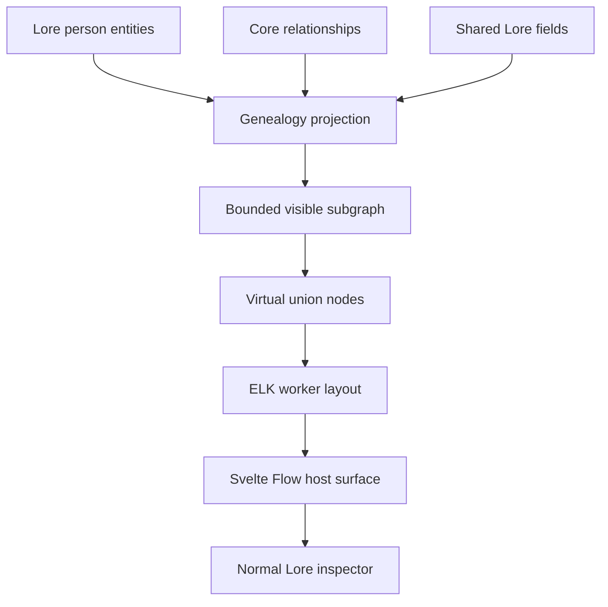

# Houses module implementation

## Status and authority

This document is the implementation authority for the first-party Houses
module, including its Tree view. It turns the Family Tree product specification
into a repository-specific delivery guide.

The documents have this precedence:

1. [`ARCHITECTURE.md`](./ARCHITECTURE.md) defines product and trust boundaries.
2. [`PLUGIN_PLATFORM_PLAN.md`](./PLUGIN_PLATFORM_PLAN.md) and
   [`PLUGIN_SDK.md`](./PLUGIN_SDK.md) define plugin contracts and lifecycle.
3. [`STORAGE.md`](./STORAGE.md) defines durable and portable project data.
4. The Family Tree product specification defines user-facing behavior.
5. This document decides how to implement that behavior within those
   boundaries.

If source code and this document disagree, verify the source and tests, then
update this document and any higher-level authority affected by the correction.

## 1. Required outcome

The first release is a bundled workspace module with ID `daena.houses`. It
owns House entities and kinship fields, and contributes two host-owned
workspace views: Houses (collection) and Tree (family neighborhood). A user
can manage houses, select a Lore person, inspect a bounded family subgraph,
expand branches, re-root the view, add or link relatives, edit or remove family
relationships, and open a person in the normal Lore inspector.

The implementation must have these properties:

- A person is always a `daena.lore:person` entity.
- Parentage and partnership are normal Daena relationships.
- Birth, death, occupation, and portraits continue to belong to Lore and the
  core asset model.
- The plugin stores no person copy, relationship copy, graph cache, layout
  coordinate, derived kinship edge, or union entity.
- Virtual union nodes and ELK coordinates exist only in memory.
- All durable mutations pass through revision-aware Rust services.
- The visible graph is bounded. The entire project is never loaded or rendered
  by default.
- Disabling the module hides Houses and Tree without deleting or changing shared
  entities and relationships.
- A clean portable checkpoint can rebuild the same family data after
  `.daena/` is removed.

## 2. Scope boundary

### 2.1 Included in v1

V1 includes:

1. bundled Houses module registration, Lore dependency, enablement, Houses collection, and Tree view;
2. root-person search and selection;
3. a Svelte Flow canvas with pan, zoom, fit, reset, and selection;
4. ELK layered layout;
5. person cards with portrait, name, birth/death, and one secondary field;
6. parent-child and partner relationships;
7. biological, adoptive, legal, guardian, step, and custom parentage;
8. marriage, partnership, betrothal, concubinage, and custom partnerships;
9. any number of parents and partners;
10. virtual parent-group/union nodes, including groups with more than two
    parents;
11. two ancestor and two descendant generations initially;
12. immediate siblings and relevant partners;
13. per-person parent, child, sibling, and partner expansion;
14. hidden-branch counts;
15. search/jump, re-root, and session-recent roots;
16. linking an existing person as parent, child, or partner;
17. creating a minimal Lore person and then linking them;
18. relationship metadata editing and relationship deletion;
19. opening a person in the normal Lore inspector;
20. authoritative self-parent and parentage-cycle rejection; and
21. responsive handling of projects containing several hundred or thousands of
    people while rendering only a local subgraph.

### 2.2 Explicitly deferred

Do not include the following in v1:

- persisted sibling, grandparent, cousin, ancestor, or descendant edges;
- the “How are these people related?” tool;
- View at Date or historical-state filtering;
- Timeline event links on family relationships;
- date plausibility warnings;
- configurable biological age rules;
- duplicate-detection diagnostics beyond exact duplicate edge prevention;
- dynasties, clans, lineage, or succession views beyond House membership;
- GEDCOM, image, PDF, print, or other import/export;
- genetic, reproductive, inheritance, or succession simulation;
- a mandatory Family entity;
- culture-specific kinship terminology;
- whole-project graph rendering;
- a second entity editor;
- saved node positions or a manual-layout mode; or
- third-party registration of arbitrary new host surfaces.

These are later milestones, not hooks to pre-build. Do not add placeholder
tables, feature flags, compatibility readers, empty services, or dormant UI for
them.

## 3. Architecture decisions

### 3.1 Use a host-owned workspace view

Houses is a declarative bundled module. Its Tree view is a host-owned
workspace surface, like Lore Wiki and Graph: the manifest does not declare a
plugin navigation view. `FamilyTreeSurface` runs in the trusted application
shell. The manifest controls registration, dependency resolution, capabilities,
enablement, and lifecycle.

This is deliberate:

- person cards can use Daena's actual theme and shared avatar component;
- selecting a person can call the existing shell selection/inspector flow;
- the canvas can participate in shell history and workspace sizing;
- no host CSS, component, or Tauri capability is exposed to an isolated
  third-party webview; and
- no duplicate “Daena-like” component library is required.

The Tree surface must still perform project reads and writes through a
`ModuleContext` built for `daena.houses`, so data operations remain attributed
to the active module and broker capability checks still run. Host-only
presentation work, such as rendering an entity avatar or opening the shell
inspector, does not expose asset bytes or shell handles to plugin code.

Do not implement Family Tree as:

- JavaScript loaded into the main webview from a plugin package;
- a separate native window;
- an iframe or child plugin webview that imitates host styling;
- an extension of Lore's existing Cytoscape graph; or
- a private database-backed module.

### 3.2 Keep the package declarative

The package contains a manifest and migration declaration, but no executable
UI or Wasm entrypoint. The manifest contract must permit an empty
`entrypoints` object for a declarative schema module with no runtime service,
including when `views` is empty because the host owns workspace navigation.

This removes the need for a fake `dist/ui/index.html` or an unused webview
bootstrap. A sandboxed view or Wasm service must continue to require its
matching entrypoint.

### 3.3 Depend on Lore

`daena.houses` has a required dependency on `daena.lore`:

```json
{
  "dependencies": {
    "daena.lore": {
      "version": ">=0.1.0 <1.0.0",
      "required": true
    }
  }
}
```

Houses cannot activate unless Lore is installed, compatible, enabled, and
active. It must not define a fallback person type when Lore is missing.

### 3.4 Use public shared data

The surface uses:

- `entity.query`, `entity.get`, and the new bounded `entity.getMany`;
- `relationship.query`, `relationship.create`, `relationship.update`, and
  `relationship.delete`;
- `field.list` with `field.read:shared` for Lore dates and secondary fields;
- a host-owned avatar renderer for profile media; and
- a host callback for opening the selected person in Lore.

It does not call raw SQLite, read portable files, invoke arbitrary Tauri
commands, or maintain a parallel projection table.



## 4. Canonical genealogy model

### 4.1 Person

Family Tree accepts only active, non-deleted entities whose type is
`daena.lore:person`.

Custom entity types authored under the Houses `schema.overlay` are
**collection-only**: they appear in the Houses collection and editor, but never
as Tree nodes. Tree roots and membership remain limited to
`daena.houses:house`. See `docs/ui-ux-slice0/MODULE_SCHEMA_COMPATIBILITY.md`.

The card data contract is:

```ts
interface FamilyPerson {
  id: string;
  name: string;
  revision: string;
  birth: CalendarDate | string | null;
  death: CalendarDate | string | null;
  secondaryLabel: string | null;
}
```

`birth` and `death` are read from shared fields in the Lore namespace and
formatted with Daena's existing calendar/date formatter. Family Tree must not
parse calendar systems, convert dates, or assume Gregorian dates.

The default secondary field is Lore `occupation`. Mark `occupation` as
`shared: true` in the Lore manifest. The Family Tree settings menu may select
another shared text or enum field that applies to `daena.lore:person`. This
choice is session UI state; it is not durable project data.

The host-owned avatar renderer receives an entity ID and displays its profile
asset if available, otherwise the normal person fallback. The plugin context
never receives unrestricted asset bytes. Portrait creation and editing remain
in Lore.

### 4.2 Parent-child relationship

Use one directed relationship type:

```text
family_parent_of
```

Direction is always:

```text
source = parent
target = child
```

Do not store the inverse `child_of`. Inverse navigation is derived by reading
incoming `family_parent_of` edges.

Declare these metadata fields:

| Key           | Type | Required | Values or meaning                                               |
| ------------- | ---- | -------- | --------------------------------------------------------------- |
| `kind`        | enum | yes      | `biological`, `adoptive`, `legal`, `guardian`, `step`, `custom` |
| `customLabel` | text | no       | Required by UI when `kind = custom`                             |
| `start`       | date | no       | When the relationship began                                     |
| `end`         | date | no       | When the relationship ended                                     |
| `notes`       | text | no       | Short author note                                               |

The core constraints are:

- self edges are forbidden;
- exact duplicate directed endpoints are forbidden; and
- the directed graph formed by `family_parent_of` must remain acyclic.

All parent kinds use the same structural rule because every kind is rendered
as a generational parent-child edge in v1. Biological plausibility is not
checked.

### 4.3 Partner relationship

Use one symmetric relationship type:

```text
family_partner_with
```

Persist endpoints in ascending UUID byte order. The lower UUID is `source` and
the higher UUID is `target`. UI labels never imply that source has a special
role.

Declare these metadata fields:

| Key           | Type | Required | Values or meaning                                               |
| ------------- | ---- | -------- | --------------------------------------------------------------- |
| `kind`        | enum | yes      | `marriage`, `partnership`, `betrothal`, `concubinage`, `custom` |
| `customLabel` | text | no       | Required by UI when `kind = custom`                             |
| `status`      | enum | no       | `active`, `ended`, `planned`, `unknown`                         |
| `start`       | date | no       | Relationship start                                              |
| `end`         | date | no       | Relationship end                                                |
| `notes`       | text | no       | Short author note                                               |

The core constraints are:

- self edges are forbidden; and
- only one undirected edge may exist for an endpoint pair.

Changing endpoints is not an edit operation. To correct the people on a
relationship, delete the relationship and create the intended one. Metadata
updates preserve identity and use the relationship revision.

### 4.4 Relationship declarations

The Family Tree schema owns both relationship types but applies them to the
foreign source type `daena.lore:person`. The manifest contract therefore needs
to accept dependency-qualified source entity types in `field.entityTypes`.

The relationship portion of the manifest is:

```json
{
  "namespaces": ["family-tree"],
  "schemas": [
    {
      "namespace": "family-tree",
      "entityTypes": [],
      "fields": [
        {
          "key": "parents",
          "label": "Parents",
          "type": "relationship",
          "relationshipType": "family_parent_of",
          "entityTypes": ["daena.lore:person"],
          "targetEntityTypes": ["daena.lore:person"],
          "cardinality": "many",
          "relationshipConstraints": {
            "allowSelf": false,
            "acyclic": true,
            "unique": "directed"
          },
          "metadataFields": [
            {
              "key": "kind",
              "label": "Parent type",
              "type": "enum",
              "required": true,
              "options": ["biological", "adoptive", "legal", "guardian", "step", "custom"]
            },
            { "key": "customLabel", "label": "Custom label", "type": "text" },
            { "key": "start", "label": "Starts", "type": "date" },
            { "key": "end", "label": "Ends", "type": "date" },
            { "key": "notes", "label": "Notes", "type": "text" }
          ]
        },
        {
          "key": "partners",
          "label": "Partners",
          "type": "relationship",
          "relationshipType": "family_partner_with",
          "entityTypes": ["daena.lore:person"],
          "targetEntityTypes": ["daena.lore:person"],
          "cardinality": "many",
          "relationshipConstraints": {
            "allowSelf": false,
            "acyclic": false,
            "unique": "undirected"
          },
          "metadataFields": [
            {
              "key": "kind",
              "label": "Partnership type",
              "type": "enum",
              "required": true,
              "options": ["marriage", "partnership", "betrothal", "concubinage", "custom"]
            },
            { "key": "customLabel", "label": "Custom label", "type": "text" },
            {
              "key": "status",
              "label": "Status",
              "type": "enum",
              "options": ["active", "ended", "planned", "unknown"]
            },
            { "key": "start", "label": "Starts", "type": "date" },
            { "key": "end", "label": "Ends", "type": "date" },
            { "key": "notes", "label": "Notes", "type": "text" }
          ]
        }
      ]
    }
  ]
}
```

Relationship metadata remains opaque JSON in canonical
`relationships.json`; its schema is derived from the enabled manifest and is
not copied into project files.

### 4.5 No plugin-owned genealogy records

Do not use module records or fields for:

- root selection;
- expanded/collapsed branches;
- recent roots;
- layout coordinates;
- virtual unions;
- hidden counts;
- cached person cards; or
- inferred relatives.

These values are either session state or derived from live entities and
relationships. The only Family Tree-authored portable data is the metadata on
its two core relationship types.

## 5. Required platform work

Complete this section before building the Family Tree UI. These are generic
contract corrections or graph primitives, not Family Tree-specific bypasses.

### 5.1 Permit empty-entrypoint declarative plugins

Update the Rust-owned manifest contract so `entrypoints` may be empty only
when:

- the plugin kind is `declarative`;
- every declared view uses a registered `host-surface` renderer, or `views`
  is empty because the host owns workspace navigation; and
- the plugin declares no provided service requiring Wasm.

Keep entrypoints mandatory for sandboxed UI and Wasm execution. Regenerate
JSON Schemas and TypeScript declarations. Do not add a fake Houses HTML
file.

Primary files:

- `crates/daena-plugin-api/src/lib.rs`
- `crates/daena-plugin-api/src/bin/gen-contract.rs`
- `packages/plugin-sdk/src/generated.ts` (generated)
- `schemas/plugin-manifest-v1.json` (generated)
- `packages/plugin-sdk/src/index.ts`
- manifest fixture and dual-validator tests under `schemas/fixtures/manifest/`
  and `scripts/`

### 5.2 Permit dependency-qualified source types

Change manifest validation for `FieldDefinition.entityTypes`:

- an unqualified ID must name an entity type owned by the declaring plugin;
- a qualified ID must have the form `<plugin-id>:<local-type>`;
- its plugin prefix must be the declaring plugin or a declared dependency;
- a Family Tree reference to `daena.lore:person` requires
  `dependencies["daena.lore"].required = true`; and
- activation resolves the referenced type against effective enabled
  manifests before registering the relationship declaration.

Unknown, disabled, optional-but-missing, or version-incompatible source types
fail activation. Do not silently drop the relationship field.

Apply the same dependency-qualified rule to `targetEntityTypes`, which already
accepts qualified strings but currently does not resolve their existence at
activation.

Primary files:

- `crates/daena-plugin-api/src/lib.rs`
- `crates/daena-plugin-host/src/lib.rs`
- `packages/plugin-sdk/src/index.ts`
- generated manifest schema/types and conformance fixtures

### 5.3 Authorize creation of a dependency-owned entity type

`entity.write` is project-entity authority, but the current host rejects
`entity.create` when the requested type is not owned by the caller. Replace
that local-only check with:

1. resolve the requested type from the effective manifest registry;
2. allow a caller-owned type; or
3. allow a type owned by a required, active dependency.

Family Tree may therefore create `daena.lore:person` but may not invent an
unknown type or create an unrelated plugin's type.

The create dialog sends only `name` and `type`. It does not write Lore fields,
because Family Tree does not own the Lore namespace. Birth, death, portrait,
occupation, and prose are edited through Lore after creation.

Apply the same registry rule when `entity.update` changes an entity's type.
Renaming a person does not change its type and remains allowed by
`entity.write`.

Primary files:

- `crates/daena-plugin-host/src/lib.rs`
- `src-tauri/src/lib.rs`
- `packages/plugin-test-host/src/index.ts`
- broker authorization and conformance tests

### 5.4 Add declarative relationship constraints

Add `relationshipConstraints` to relationship field definitions:

```ts
interface RelationshipConstraints {
  allowSelf: boolean;
  acyclic: boolean;
  unique: "none" | "directed" | "undirected";
}
```

Rules:

- It is valid only on `type: "relationship"`.
- Defaults are `allowSelf: true`, `acyclic: false`, and `unique: "none"` for
  existing manifests.
- A plugin may define constraints only for a relationship type it owns.
- All declarations of one relationship type must agree.
- Rust validates constraints inside the same transaction as relationship
  creation or endpoint replacement.
- `acyclic` checks the complete live graph for that relationship type, not
  only the currently visible subgraph.
- `unique: "undirected"` canonicalizes endpoint order before duplicate
  checking and persistence.
- Rejection leaves rows, revisions, mutation receipts, and content generation
  unchanged.

Return typed broker errors:

- `relationship.self`;
- `relationship.duplicate`; and
- `relationship.cycle`.

Do not rely on a Svelte-only cycle check. The UI may preflight for immediate
feedback, but Rust is authoritative.

Primary files:

- `crates/daena-plugin-api/src/lib.rs`
- `crates/daena-plugin-api/src/schema_overlay.rs`
- `crates/daena-core/src/project.rs`
- `crates/daena-plugin-host/src/lib.rs`
- `src-tauri/src/lib.rs`
- generated schemas and SDK types

### 5.5 Add bounded batch reads

Per-person `relationship.list` calls create an N+1 RPC pattern. Add these
generic broker methods:

```ts
entity.getMany({
  ids: string[] // 1..500 unique IDs
}) => EntityRecord[]

relationship.query({
  entityIds: string[],       // 1..200 unique IDs
  relationshipTypes: string[], // empty means all visible types
  direction: "incoming" | "outgoing" | "any",
  offset?: number,
  limit?: number             // default 200, maximum 500
}) => {
  items: Relationship[];
  total: number;
  offset: number;
  limit: number;
  hasMore: boolean;
}
```

`relationship.query` returns each matching relationship once even when both
endpoints are in `entityIds`. Filtering and pagination happen in SQLite.
Results sort by relationship ID for deterministic paging. Soft-deleted entity
endpoints are omitted from Family Tree after entity hydration.

Add typed SDK wrappers and corresponding `ModuleContext` methods. Keep
`relationship.list` and `entity.get`; existing consumers still need them.

Update the capability registry so `relationship.write` explicitly lists
`create`, `update`, and `delete`, matching the executable catalog.

Primary files:

- `crates/daena-plugin-api/src/catalog.rs`
- `crates/daena-plugin-api/src/rpc.rs`
- `crates/daena-plugin-api/src/lib.rs`
- `crates/daena-core/src/project.rs`
- `crates/daena-plugin-host/src/lib.rs`
- `src-tauri/src/lib.rs`
- `packages/plugin-sdk/src/index.ts`
- `packages/module-api/src/index.ts`
- `src/lib/modules/context.ts`
- generated RPC, error, capability, and TypeScript artifacts

## 6. Plugin manifest and registration

Create `packages/modules/houses/manifest.json` with:

- `id`: `daena.houses`;
- `name`: `Houses`;
- `publisher`: `daena-archive`;
- `version`: `0.1.0`;
- `hostApi`: `>=1.0.0 <2.0.0`;
- `kind`: `declarative`;
- `entrypoints`: `{}`;
- required Lore dependency;
- namespace `family-tree`;
- House entity type plus kinship and membership fields from section 4;
- empty `views` (host-owned Houses and Tree navigation);
- no commands, records, services, or events; and
- one `0 -> 1` backup migration that creates the `family-tree` namespace.

Request only:

```json
[
  "entity.read",
  "entity.write",
  "entity.delete",
  "field.read:shared",
  "relationship.read",
  "relationship.write",
  "schema.overlay"
]
```

Do not request document access, field writes, assets, search, records, AI,
network, filesystem, or shell capabilities.

Register the manifest in the Rust bundled catalog alongside Lore, Timeline,
Writing, Maps, and Language. Add it to the canonical manifest positive
controls and plugin conformance suite.

Houses is a fixed `WorkspaceSection`. Its rail item appears when the module is
enabled and active. Tree is a workspace view, not a plugin-tool view.

## 7. Frontend structure

Add the host implementation under:

```text
src/lib/family-tree/
  FamilyTreeSurface.svelte
  FamilyTreeCanvas.svelte
  FamilyPersonNode.svelte
  FamilyUnionNode.svelte
  FamilyRelationshipPanel.svelte
  FamilyMemberDialog.svelte
  FamilyRootPicker.svelte
  model.ts
  projection.ts
  unions.ts
  layout.ts
  layout.worker.ts
  state.ts
```

Keep pure graph transformation code in `.ts` files with no Svelte imports.
Svelte components own rendering and interaction only.

Add `@xyflow/svelte` and `elkjs` through npm. Do not copy either library into
the repository or pin a fabricated version. Commit the package manager's
resolved versions and lockfile changes when implementation is committed.

Mount `FamilyTreeSurface` as the Houses workspace Tree view in
`src/routes/+page.svelte`. Render it with:

- a `ModuleContext` built for the Houses manifest;
- the current project ID;
- an `onOpenEntity(entityId)` callback that leaves the Tree view and runs
  the normal Lore `selectEntity` path; and
- shell-history state callbacks for the current root.

Do not place project or Tauri clients in the Family Tree components. The
surface's data dependency is `ModuleContext`; host navigation and avatar
rendering are explicit component callbacks/components.

## 8. Projection and visible-subgraph algorithm

### 8.1 Normalized graph

Normalize live records into:

```ts
interface GenealogyGraph {
  people: Map<string, FamilyPerson>;
  parentsByChild: Map<string, Set<string>>;
  childrenByParent: Map<string, Set<string>>;
  partnersByPerson: Map<string, Set<string>>;
  relationships: Map<string, FamilyRelationship>;
}
```

Ignore relationships whose endpoints cannot both be resolved to active
`daena.lore:person` entities. Report their IDs in a non-blocking data warning;
do not delete or repair them automatically.

Metadata parsing is strict:

- malformed JSON or values outside the active schema produce a warning;
- the edge still renders with an “Unknown” label if core returned it from an
  older valid checkpoint; and
- editing requires the user to replace invalid values with schema-valid
  values.

### 8.2 Initial neighborhood

For a selected root:

1. include the root;
2. walk incoming `family_parent_of` edges for two ancestor generations;
3. walk outgoing `family_parent_of` edges for two descendant generations;
4. include immediate siblings: other children of each direct parent;
5. include active, planned, or unknown-status partners of every included
   person;
6. include ended partners only when they share a visible child or the user
   explicitly expands partners; and
7. hydrate all discovered entity IDs and shared Lore fields in batches.

Use frontier batches with `relationship.query`; do not issue one relationship
request per card. Deduplicate IDs and relationships at every step.

### 8.3 Expansion state

Track expansion by person and direction:

```ts
type BranchDirection = "parents" | "children" | "siblings" | "partners";
type ExpansionKey = `${string}:${BranchDirection}`;
```

The initial root neighborhood is represented by the same expansion model as
manual expansion. Expanding a branch adds one graph layer. Collapsing removes
nodes that are no longer reachable from any remaining visible expansion path.
Never remove the root or the currently selected card.

Before committing a new visible graph, compute reference counts from all
active paths. This prevents collapsing one branch from removing a person also
visible through another parent, partner, or consanguineous path.

### 8.4 Hidden counts

For each visible person, calculate counts from fetched incident relationships:

- hidden parents;
- hidden children;
- hidden siblings; and
- hidden partners.

Display controls only for non-zero counts, for example `↑ 2 parents` or
`↓ 7 children`. “Descendants” is not used for a one-layer control because it
would imply a recursive count that v1 does not fetch.

If a query page is truncated, display `99+` or the known lower bound rather
than an incorrect exact number.

### 8.5 Limits

Use these hard limits:

- 250 visible person nodes;
- 150 virtual union nodes;
- 500 visible relationship edges;
- 200 relationship records per normal page, with a maximum page size of 500;
  and
- six expansions from the current root in one direction.

When an action would exceed a limit, leave the current graph unchanged and
show: “This branch is too large to display at once. Re-root on a nearby person
to continue.” Offer the candidate person as a re-root action.

## 9. Virtual unions and layout graph

### 9.1 Union generation

Virtual unions are deterministic render nodes, never entities.

For every visible child:

1. collect all visible `family_parent_of` sources;
2. sort parent IDs;
3. if there is one parent, render a direct parent-to-child edge;
4. if there are two or more parents, create one parent-group node keyed by
   `union:parents:<sorted-parent-ids>`;
5. connect every parent to that group and the group to the child; and
6. reuse the same group for other children with the exact same visible parent
   set.

For every visible `family_partner_with` relationship:

- reuse the matching two-person parent group when one exists;
- otherwise create `union:partner:<relationship-id>`; and
- connect both people to the union without implying direction.

A child with three parents attaches to one three-parent group. A person with
multiple partners participates in multiple union nodes. Half-siblings naturally
attach to different parent groups that share one person node.

Do not infer a partnership merely because two people share a child. The
parent-group node may exist without a partnership relationship.

### 9.2 ELK input

Create an ELK layered graph containing:

- fixed-size person nodes;
- small fixed-size union nodes;
- person-to-union, union-to-child, and direct single-parent edges; and
- stable port IDs based on node and edge IDs.

Initial layout options:

```ts
{
  "elk.algorithm": "layered",
  "elk.direction": "DOWN",
  "elk.layered.spacing.nodeNodeBetweenLayers": "90",
  "elk.spacing.nodeNode": "42",
  "elk.spacing.edgeNode": "24",
  "elk.layered.nodePlacement.strategy": "NETWORK_SIMPLEX",
  "elk.layered.crossingMinimization.strategy": "LAYER_SWEEP",
  "elk.layered.considerModelOrder.strategy": "NODES_AND_EDGES"
}
```

Use a person node size of 220 × 92 CSS pixels and a union node size of 12 × 12
CSS pixels. Measure only if card content changes those fixed dimensions; do not
run a layout-observer loop.

Sort nodes and edges by stable ID before sending them to ELK. Provide the prior
visible order as model order so an expansion moves existing cards as little as
possible.

### 9.3 Worker and stale results

Run ELK in `layout.worker.ts`, not on the Svelte event loop. Every request has a
monotonically increasing generation. Apply a result only if its generation is
still current. Starting a newer layout makes all older results stale; stale
results are ignored without mutating canvas state.

On worker failure:

1. keep the previous valid layout;
2. show a retry action;
3. log bounded diagnostics without entity prose or relationship notes; and
4. do not fall back to an unbounded force layout.

Call fit-to-view after initial load and explicit re-root. Do not automatically
fit after every branch expansion, because that steals the user's viewport.

## 10. Canvas and interaction design

### 10.1 Surface structure

The surface has:

1. a host workspace top bar with title and current root;
2. a toolbar with root search, recent roots, secondary-field choice, fit, and
   reset;
3. the Svelte Flow canvas;
4. a relationship side panel when an edge is selected; and
5. dialogs for adding or linking a family member.

The default empty state contains a root-person picker. If no Lore people exist,
offer “Create person” and explain that the person will also appear in Lore.

### 10.2 Person cards

Each card shows:

- host-rendered profile avatar or standard fallback;
- primary name;
- formatted birth–death range when present;
- selected secondary field when present;
- a root marker on the current root;
- a selection state; and
- compact branch controls only when hidden neighbors exist.

Card behavior:

- single click selects;
- double click or “Open in Lore” opens the normal inspector;
- “Make root” re-roots without editing data; and
- add-parent, add-child, and add-partner actions open the member dialog.

Do not place full notes, relationship metadata, or editable fields on cards.

### 10.3 Relationship lines

Render:

- parent-child as a solid line with an arrow toward the child;
- adoptive, legal, guardian, and step parentage with a distinct dash/marker
  pattern plus an accessible label;
- partner edges as a double or parallel unarrowed line into the union; and
- selected edges with width and marker changes, not color alone.

Hover/focus tooltips show the relationship label and date range. Notes remain
in the side panel.

### 10.4 Root and recent roots

Root search uses paged `entity.query` scoped to `daena.lore:person`; it does not
load all people and filter them in Svelte.

Keep the ten most recent root IDs per open project in memory. Remove missing or
deleted people when resolving the menu. Shell back/forward restores root ID,
selected person/relationship, expansion keys, and viewport for the active
session. Do not write recent roots to portable plugin state.

### 10.5 Accessibility

The canvas must not be the only navigation path:

- every toolbar action has a text label or accessible name;
- cards are keyboard focusable;
- arrow keys move to the nearest card in the requested visual direction;
- Enter selects, and Shift+Enter re-roots;
- relationship lines are represented in a keyboard-accessible connections list
  for the selected person;
- line meaning is conveyed by marker/pattern and text, not color alone;
- focus is restored to the invoking card after a dialog closes;
- dialogs trap focus and close with Escape only when no save is running; and
- zoom controls meet host button size and contrast rules.

Honor `prefers-reduced-motion`: disable animated viewport and node
transitions, but keep direct pan and zoom.

## 11. Mutation flows

### 11.1 Link an existing parent

1. Query Lore people excluding the current person and already linked parents.
2. Let the user choose parent kind and optional metadata.
3. Fetch the latest candidate-parent entity revision.
4. Preflight the visible graph for an obvious cycle.
5. Create `candidate -> current` as `family_parent_of` with the candidate
   revision and a UUID request ID.
6. On success, merge the returned relationship and request a new layout.
7. On `relationship.cycle`, leave the graph unchanged and explain the path that
   would become cyclic when available.

### 11.2 Link an existing child

Follow the same flow but create `current -> candidate`. Use the latest current
entity revision.

### 11.3 Link an existing partner

1. Exclude the current person and existing partners.
2. Collect kind, status, dates, and notes.
3. Sort endpoint UUIDs before submitting.
4. Use the latest revision of the canonical source endpoint.
5. Create `family_partner_with`.

The core repeats endpoint canonicalization and duplicate validation.

### 11.4 Create and link a person

The dialog has two explicit steps:

1. create `{ name, type: "daena.lore:person" }`; then
2. create the requested family relationship.

Each step receives a separate stable UUID request ID. Do not pretend these two
mutations are atomic.

If person creation succeeds and relationship creation fails, retain the valid
person and show:

- Retry relationship;
- Open person in Lore; and
- Cancel.

Do not automatically delete the person, because entity deletion is destructive
and Family Tree does not request `entity.delete`.

After a successful link, offer “Open in Lore to add dates, portrait, and
details.”

### 11.5 Edit a relationship

Selecting a family edge opens a schema-driven panel using the metadata
definitions from the effective manifest.

- Metadata-only save calls `relationship.update`.
- The request includes the observed relationship revision and a UUID request
  ID.
- `customLabel` is required by the UI when kind is `custom`.
- Empty optional strings are omitted from serialized metadata.
- Endpoint changes are not offered.
- A stale revision keeps the user's draft and offers Reload or Review current
  values; it never retries against a new revision automatically.

Delete requires a confirmation naming both people and the relationship kind.
It calls `relationship.delete` with the relationship ID, type, observed
revision, and UUID request ID. Deleting a relationship never deletes either
person.

## 12. State, events, and consistency

### 12.1 Source of truth

Component stores are snapshots, not authorities. After any mutation:

- use the returned revisioned record immediately;
- invalidate affected relationship pages;
- refetch the smallest affected frontier when hidden counts may have changed;
  and
- never edit a second cached relationship representation.

Subscribe to the existing post-commit entity/relationship change mechanism if
it becomes available to host surfaces during implementation. Otherwise refetch
on surface focus and after local mutations. Do not add a Family Tree durable
event queue.

### 12.2 Request cancellation

Give every root load and expansion an `AbortController`. Re-rooting, closing
the surface, disabling the plugin, or closing the project cancels pending reads
and invalidates layout generations. A cancelled request does not show an error
toast.

### 12.3 Conflicts

Revision conflicts are user-visible:

- reads may be repeated;
- mutations retain the same request ID only when retrying the identical
  payload;
- a changed payload receives a new request ID;
- the UI never silently applies a mutation against a newly fetched revision;
  and
- relationship drafts survive conflict handling until saved or discarded.

### 12.4 Diagnostics

Show non-blocking warnings for:

- missing endpoints;
- wrong endpoint entity types;
- invalid legacy metadata;
- page truncation; and
- a layout worker failure.

Warnings include stable IDs and concise labels but not document bodies or
private plugin fields. Structural mutation failures are errors and leave the
last valid graph visible.

## 13. Performance budgets

Use a deterministic benchmark fixture with 1,000 people, 1,500 parent edges,
and 600 partner edges, including remarriage, adoption, three-parent groups,
half-siblings, and cousin marriage.

On the repository's release reference machine:

- initial two-up/two-down projection must complete in 200 ms at p95 excluding
  first database open;
- ELK layout for 250 people plus 150 unions must complete in 500 ms at p95 in
  the worker;
- root search must return its first 50 results in 150 ms at p95;
- branch expansion must yield to the event loop before data fetch and layout;
- pan and zoom must remain interactive while a layout request is pending; and
- the DOM must never contain more than the configured visible person and union
  caps.

Record timings separately for SQLite query, projection, union generation, ELK,
and Svelte Flow update. Do not optimize by persisting a second genealogy index
unless profiling proves the general relationship indexes insufficient and a
new architecture decision explicitly authorizes a disposable core projection.

Lazy-load portrait bytes only for cards entering or near the viewport. Release
object URLs when cards unmount.

## 14. Implementation sequence and exit gates

### Phase 0: Public contract and authority

Implement:

- empty-entrypoint declarative manifests, including empty host-owned `views`;
- dependency-qualified source/target entity types;
- dependency-owned entity creation;
- relationship constraints and typed errors;
- bounded batch reads;
- SDK, ModuleContext, generated artifacts, and fake-host parity; and
- `relationship.write` capability operation correction.

Exit gate:

- Rust and TypeScript validators agree;
- generated schemas and SDK declarations have no drift;
- allow and deny paths pass in Rust and the fake host;
- a dependency cannot reference an undeclared or disabled type;
- cycle and uniqueness failures are atomic; and
- no Family Tree UI code has been added to compensate for missing authority.

### Phase 1: Manifest and read-only projection

Implement:

- Houses manifest, dependency, migration, bundled registration, and
  conformance coverage;
- host-owned Houses and Tree workspace views;
- root picker and search;
- batched genealogy projection;
- virtual unions;
- ELK worker; and
- read-only Svelte Flow canvas and person cards.

Exit gate:

- enable/disable controls view availability;
- a root with multiple partners, half-siblings, and more than two parents
  lays out without overlap or corrupted edges;
- opening a person reaches the normal Lore inspector;
- no genealogy-specific project row or file exists outside core relationships;
  and
- stale worker results cannot replace the current root's layout.

### Phase 2: Expansion and editing

Implement:

- expansion/collapse and hidden counts;
- recent roots and shell-history state;
- existing-person linking;
- minimal person creation;
- metadata editor;
- relationship deletion;
- conflict UI; and
- keyboard connections list.

Exit gate:

- every mutation is revision-protected and request-ID aware;
- cycles and duplicates produce typed errors;
- create-then-link partial failure is explicit and recoverable;
- collapsing shared paths does not remove still-reachable people; and
- disabled module data remains visible as ordinary relationships elsewhere in
  Daena.

### Phase 3: Native and storage hardening

Implement:

- large fixture and performance instrumentation;
- Tauri-native rendered checks;
- checkpoint/rebuild coverage;
- project close, plugin disable, and cancellation tests;
- reduced-motion and keyboard checks; and
- bounded diagnostics.

Exit gate:

- all section 16 acceptance criteria pass;
- focused and full checks pass;
- the clean checkpoint rebuild test passes after deleting the fixture
  project's `.daena/`; and
- the native surface has been exercised in a packaged Tauri application.

## 15. Test plan

### 15.1 Contract and broker tests

Add Rust and TypeScript tests for:

- empty-entrypoint declarative acceptance, including empty `views`, and all invalid variants;
- required dependency-qualified source and target types;
- missing/disabled/incompatible dependency failure;
- foreign entity creation allowed only through a required dependency;
- batch limits, duplicates, deterministic pagination, and capability denial;
- parent self-edge rejection;
- directed and undirected duplicate rejection;
- parent cycle rejection at depth 1, depth N, and across unloaded nodes;
- relationship update/delete under `relationship.write`;
- stale revisions; and
- request-ID replay with identical and different payloads.

### 15.2 Projection tests

Add pure TypeScript tests under `scripts/` for:

- two ancestor and descendant generations;
- one, two, and three parents;
- siblings and half-siblings;
- multiple sequential and simultaneous partners;
- childless partnerships;
- children whose parents have no partner edge;
- cousin marriage without recursive traversal;
- shared-node reference counting during collapse;
- hidden counts and truncation lower bounds;
- soft-deleted or missing endpoints;
- stable union IDs and deterministic ordering;
- visible caps and re-root fallback; and
- stale layout generation rejection.

### 15.3 UI and native tests

Unit-level DOM checks do not prove a Tauri host surface. Exercise the packaged
desktop boundary:

- enable and disable the plugin;
- open the manifest-contributed view;
- resize the workspace and inspector;
- pan, zoom, fit, and reset;
- expand and collapse from mouse and keyboard;
- open a person in Lore and navigate back;
- create/link/edit/delete relationships;
- provoke a cycle and a stale-revision conflict;
- close the project during fetch and layout;
- switch theme and verify host tokens;
- verify reduced motion;
- verify line meaning without color; and
- reopen the project and confirm shared data.

Browser automation alone is not accepted because it cannot exercise Daena's
native Tauri application.

### 15.4 Storage round trip

Use a temporary project, never the repository working tree:

1. create Lore people and all Family Tree relationship kinds;
2. enable Family Tree and mutate metadata through the broker;
3. flush a clean checkpoint;
4. record entity IDs, relationship IDs, metadata, and revisions;
5. close the project;
6. delete only that temporary project's `.daena/`;
7. reopen from portable files;
8. verify people and relationships are identical;
9. verify the derived visible graph and virtual unions recompute; and
10. verify no layout, recent-root, hidden-count, or inferred-kinship data was
    present in portable files.

Also verify that malformed external relationship paths or references block
rebuild with typed diagnostics rather than producing a partial tree.

### 15.5 Commands

Use repository wrappers and explicit manifests:

```sh
rtk npm install @xyflow/svelte elkjs
rtk npm run gen:plugin-contract
rtk npm run build:plugin-sdk
rtk npm run check:plugin-contract
rtk npm run test:plugin-conformance
rtk npm run check:plugin-isolation
rtk npm run check
rtk npm run test
rtk npm run build
rtk cargo test --manifest-path src-tauri/Cargo.toml --locked --offline
```

Add focused script commands for Family Tree projection, layout, and UI tests,
then include them in the appropriate aggregate npm test target. Do not replace
focused checks with the full suite during development; run both before the
phase exit gate.

## 16. V1 acceptance checklist

V1 is complete only when all items below are demonstrated:

- [ ] `daena.houses` installs as a bundled workspace module.
- [ ] Enabling it succeeds only with its required Lore dependency active and
      contributes Houses and Tree workspace views.
- [ ] Disabling it removes the workspace without deleting shared data.
- [ ] A user can select an existing Lore person as root.
- [ ] The initial view shows two ancestor and two descendant generations,
      immediate siblings, and relevant partners.
- [ ] A user can pan, zoom, fit, reset, select, expand, collapse, and re-root.
- [ ] Multiple partners, half-siblings, and three-parent groups render without
      layout corruption.
- [ ] Cards show the normal portrait fallback, name, Daena-formatted life
      dates, and configured secondary field.
- [ ] Parent kinds and partner kinds are distinguishable without color alone.
- [ ] A user can link an existing parent, child, or partner.
- [ ] A user can create a minimal Lore person and link them.
- [ ] A user can edit and delete the underlying relationship.
- [ ] A user can open any visible person in the normal Lore inspector.
- [ ] Self-parent, duplicate, and parent-cycle writes are rejected atomically
      by Rust.
- [ ] Stale mutations never overwrite a newer revision.
- [ ] A several-hundred-person genealogy remains navigable without rendering
      the entire graph.
- [ ] The 1,000-person benchmark stays within the section 13 budgets.
- [ ] Closing, disabling, or re-rooting cancels pending work cleanly.
- [ ] A clean checkpoint rebuild after deleting `.daena/` reproduces all
      people, relationships, and metadata.
- [ ] Portable data contains no person copy, relationship copy, union node,
      layout coordinate, recent root, or derived kinship edge.
- [ ] Contract, focused, full frontend, Rust, and production build checks pass.
- [ ] The packaged Tauri application passes the native interaction checklist.

## 17. Definition of done

The work is done when the acceptance checklist passes and the implementation
still obeys the core boundary: Daena owns durable people and relationships;
Houses adds house entities, genealogy meaning, and a specialized Tree view;
ELK owns only coordinates; Svelte Flow owns only canvas rendering and
interaction.

Any proposal to persist virtual unions, cache a second family graph, bypass
broker attribution, load all people by default, or create a Houses person
type is an architecture regression and must be rejected rather than hidden
behind a compatibility shim.
