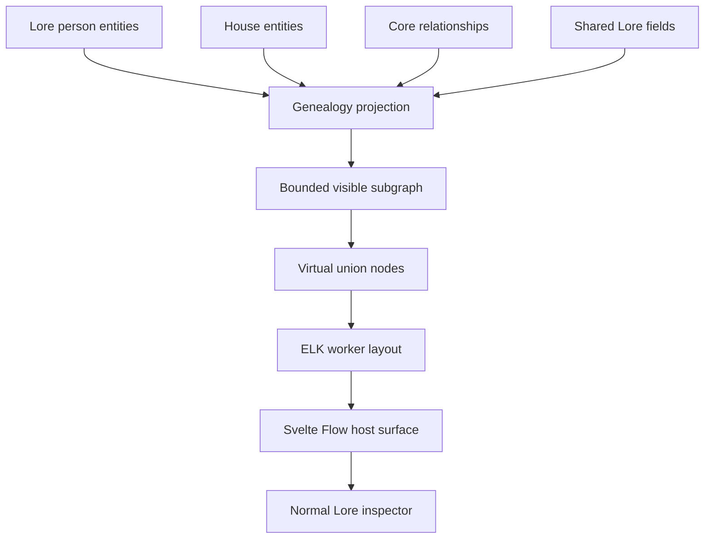

# Houses module

## Purpose and authority

This document is the architecture and data-contract authority for the bundled
Houses module (`daena.houses`) and its host-owned Tree view.

It is subordinate to:

1. [`ARCHITECTURE.md`](./ARCHITECTURE.md) for product and trust boundaries.
2. [`PLUGIN_PLATFORM_PLAN.md`](./PLUGIN_PLATFORM_PLAN.md) and
   [`PLUGIN_SDK.md`](./PLUGIN_SDK.md) for plugin contracts and lifecycle.
3. [`STORAGE.md`](./STORAGE.md) for durable and portable project data.
4. [`UI_UX.md`](./UI_UX.md) for author-facing Houses/Tree vocabulary and chrome.

Exact field shapes live in `packages/modules/houses/manifest.json`. Host
implementation lives in `src/lib/houses/`. If source and this document
disagree, verify the source and tests, then update this document.

## Product model

Houses is a first-party workspace module. It owns House entities and kinship
fields, and the host contributes two workspace views:

- **Houses** — collection of `daena.houses:house` entities.
- **Tree** — a bounded family neighborhood around a Lore person or a house.

A person is always a `daena.lore:person`. Parentage, partnership, and house
membership are normal Daena relationships. Birth, death, occupation, and
portraits belong to Lore and the core asset model.

```text
daena.lore:person
  +-- family_parent_of (directed, acyclic)
  +-- family_partner_with (undirected)
  +-- family_member_of --> daena.houses:house
```

Houses stores no person copy, relationship copy, graph cache, layout
coordinate, derived kinship edge, or union entity. Virtual union nodes and ELK
coordinates exist only in memory. All durable mutations pass through
revision-aware Rust services. The visible graph is bounded; the entire project
is never loaded or rendered by default.

Disabling the module hides Houses and Tree without deleting or changing shared
entities and relationships. A clean portable checkpoint rebuilds the same
house and kinship data after `.daena/` is removed.

Custom entity types authored under the Houses `schema.overlay` are
**collection-only**: they appear in the Houses collection and editor, but never
as Tree nodes. Tree roots and membership remain limited to
`daena.lore:person` and `daena.houses:house`. See [`UI_UX.md`](./UI_UX.md).

## Core principles

### Host-owned workspace views

Houses is a declarative bundled module. Houses and Tree are host-owned
workspace surfaces, like Lore Wiki and Graph: the manifest does not declare a
plugin navigation view. `TreeSurface` runs in the trusted application shell.
The manifest controls registration, dependency resolution, capabilities,
enablement, and lifecycle.

This keeps person cards on Daena's theme and shared avatar, lets selection
use the existing shell inspector, and keeps the canvas in shell history and
workspace sizing. No host CSS, component, or Tauri capability is exposed to an
isolated third-party webview.

Reads and writes still go through a `ModuleContext` built for `daena.houses`,
so data operations stay attributed to the active module and broker capability
checks still run. Host-only presentation (entity avatar, opening the Lore
inspector) does not expose asset bytes or shell handles to plugin code.

Houses is not JavaScript loaded into the main webview from a plugin package, a
separate native window, an iframe that imitates host styling, an extension of
Lore's Cytoscape graph, or a private database-backed module.

### Declarative package

The package is a manifest and migration declaration with no executable UI or
Wasm entrypoint. `entrypoints` and `views` are empty because the host owns
workspace navigation. A sandboxed view or Wasm service still requires its
matching entrypoint.

### Lore dependency

`daena.houses` has a required dependency on `daena.lore`. Houses cannot
activate unless Lore is installed, compatible, enabled, and active. It does
not define a fallback person type.

### Public shared data

The surface uses `entity.query`, `entity.get`, `entity.getMany`,
`relationship.query` / `create` / `update` / `delete`, and `field.list` with
`field.read:shared` for Lore dates and secondary fields. A host-owned avatar
renderer shows profile media. Opening a person uses a host callback into Lore.

It does not call raw SQLite, read portable files, invoke arbitrary Tauri
commands, or maintain a parallel projection table.



## Manifest and registration

`packages/modules/houses/manifest.json` declares:

- `id`: `daena.houses`
- `kind`: `declarative`
- `entrypoints`: `{}`
- required Lore dependency
- namespace `houses`
- House entity type, house identity fields (summary, aliases, founded, allies, rivals), kinship fields, and membership fields
- empty `views` (host-owned Houses and Tree navigation)
- no commands, records, services, or events
- one `0 -> 1` backup migration (`houses-v1`) that creates the `houses`
  namespace

Capabilities:

```json
[
  "entity.read",
  "entity.write",
  "entity.delete",
  "field.read:shared",
  "relationship.read",
  "relationship.write",
  "schema.overlay"
]
```

Houses does not request document access, field writes, assets, search,
records, AI, network, filesystem, or shell capabilities.

The module is registered in the Rust bundled catalog. Houses is a fixed
`WorkspaceSection`. Its rail item appears when the module is enabled and
active. Tree is a workspace view, not a plugin-tool view.

## Genealogy model

### Person

Tree accepts only active, non-deleted entities whose type is
`daena.lore:person`.

Card data:

```ts
interface FamilyPerson {
  id: string;
  name: string;
  revision: string;
  birth: CalendarDate | string | null;
  death: CalendarDate | string | null;
  secondaryLabel: string | null;
}
```

`birth` and `death` are read from shared fields in the Lore namespace and
formatted with Daena's existing calendar/date formatter. Houses does not parse
calendar systems, convert dates, or assume Gregorian dates.

The default secondary field is Lore `occupation` (`shared: true`). The Tree
settings menu may select another shared text or enum field that applies to
`daena.lore:person`. That choice is session UI state, not durable project
data.

The host-owned avatar renderer receives an entity ID and displays its profile
asset if available, otherwise the normal person fallback. Portrait creation
and editing remain in Lore.

### Parent-child

Directed relationship type `family_parent_of`:

```text
source = parent
target = child
```

There is no stored inverse `child_of`. Inverse navigation is derived from
incoming `family_parent_of` edges. The manifest exposes both directions as
fields: `parents` (incoming) and `children` (outgoing).

| Key           | Type | Required | Values                                                          |
| ------------- | ---- | -------- | --------------------------------------------------------------- |
| `kind`        | enum | yes      | `biological`, `adoptive`, `legal`, `guardian`, `step`, `custom` |
| `customLabel` | text | no       | Required by UI when `kind = custom`                             |
| `start`       | date | no       | When the relationship began                                     |
| `end`         | date | no       | When the relationship ended                                     |
| `notes`       | text | no       | Short author note                                               |

Constraints: no self edges; no exact duplicate directed endpoints; the
directed `family_parent_of` graph is acyclic. All parent kinds use the same
structural rule. Biological plausibility is not checked.

### Partnership

Symmetric relationship type `family_partner_with`. Endpoints persist in
ascending UUID byte order. The lower UUID is `source` and the higher UUID is
`target`. UI labels never imply that source has a special role.

| Key           | Type | Required | Values                                                          |
| ------------- | ---- | -------- | --------------------------------------------------------------- |
| `kind`        | enum | yes      | `marriage`, `partnership`, `betrothal`, `concubinage`, `custom` |
| `customLabel` | text | no       | Required by UI when `kind = custom`                             |
| `status`      | enum | no       | `active`, `ended`, `planned`, `unknown`                         |
| `start`       | date | no       | Relationship start                                              |
| `end`         | date | no       | Relationship end                                                |
| `notes`       | text | no       | Short author note                                               |

Constraints: no self edges; only one undirected edge per endpoint pair.
Changing endpoints is not an edit: delete the relationship and create the
intended one. Metadata updates preserve identity and use the relationship
revision.

### House

House entities (`daena.houses:house`) carry identity fields in the `houses`
namespace: `summary`, `aliases`, `founded`, plus undirected `house_allied_with`
and `house_rival_of` relationships (other houses or Lore factions). Manifest
fields use the local `house` id; load-time normalize qualifies it.

### House membership

Directed relationship type `family_member_of`:

```text
source = person
target = house
```

The manifest exposes `houses` on a person (outgoing) and `members` on a house
(incoming).

| Key           | Type | Required | Values                                                   |
| ------------- | ---- | -------- | -------------------------------------------------------- |
| `role`        | enum | yes      | `member`, `head`, `consort`, `heir`, `founder`, `custom` |
| `customLabel` | text | no       | Required by UI when `role = custom`                      |
| `notes`       | text | no       | Short author note                                        |

Constraints: no self edges; unique directed endpoints. A person may belong to
more than one house.

### Relationship ownership

Houses owns the relationship types and applies them to `daena.lore:person`
and `daena.houses:house`. Manifest `field.entityTypes` / `targetEntityTypes`
accept dependency-qualified IDs (`daena.lore:person`). Unknown, disabled, or
incompatible source types fail activation; the relationship field is not
silently dropped.

Relationship metadata remains opaque JSON in canonical `relationships.json`.
Its schema is derived from the enabled manifest and is not copied into
project files.

Rust validates `relationshipConstraints` in the same transaction as
relationship creation or endpoint replacement. `acyclic` checks the complete
live graph for that relationship type, not only the visible subgraph.
`unique: "undirected"` canonicalizes endpoint order before duplicate checking.
Rejection leaves rows, revisions, mutation receipts, and content generation
unchanged.

Typed broker errors: `relationship.self`, `relationship.duplicate`,
`relationship.cycle`. The UI may preflight; Rust is authoritative.

### What is not stored

These values are session state or derived from live entities and
relationships:

- root selection, expanded/collapsed branches, recent roots
- layout coordinates, virtual unions, hidden counts
- cached person cards, inferred relatives

Portable Houses data is house entities plus metadata on `family_parent_of`,
`family_partner_with`, and `family_member_of`.

## Host implementation

Host code lives under `src/lib/houses/`. Pure graph transformation stays in
`.ts` files with no Svelte imports. Svelte components own rendering and
interaction.

```text
src/lib/houses/
  TreeSurface.svelte
  TreeCanvas.svelte
  TreeLanding.svelte
  FamilyPersonNode.svelte
  FamilyUnionNode.svelte
  FamilyPersonPanel.svelte
  FamilyHousePanel.svelte
  FamilyRelationshipPanel.svelte
  FamilyRelationshipEdge.svelte
  FamilyMemberDialog.svelte
  FamilyMembershipDialog.svelte
  FamilyRootPicker.svelte
  model.ts
  projection.ts
  unions.ts
  layout.ts
  layout.worker.ts
  state.ts
  fetch.ts
  mutations.ts
```

`TreeSurface` is mounted from `src/routes/+page.svelte` with a Houses
`ModuleContext`, the current project ID, an `onOpenEntity` callback that
leaves Tree and runs Lore `selectEntity`, and shell-history callbacks for the
current root. Houses components do not hold project or Tauri clients.

Layout uses `@xyflow/svelte` and `elkjs`.

Houses may create `daena.lore:person` because that type is owned by a
required, active dependency. The create dialog sends only `name` and `type`.
Birth, death, portrait, occupation, and prose are edited in Lore after
creation.

Bounded batch reads avoid N+1 RPCs: `entity.getMany` (1..500 unique IDs) and
`relationship.query` (1..200 entity IDs, default page 200, max 500).
`relationship.query` returns each matching relationship once even when both
endpoints are in `entityIds`. Results sort by relationship ID. Soft-deleted
entity endpoints are omitted from Tree after hydration.

## Projection and visible subgraph

### Normalized graph

```ts
interface GenealogyGraph {
  people: Map<string, FamilyPerson>;
  parentsByChild: Map<string, Set<string>>;
  childrenByParent: Map<string, Set<string>>;
  partnersByPerson: Map<string, Set<string>>;
  relationships: Map<string, FamilyRelationship>;
}
```

Relationships whose endpoints cannot both resolve to active
`daena.lore:person` entities are ignored. Their IDs appear in a non-blocking
data warning; they are not deleted or repaired automatically.

Malformed metadata JSON or values outside the active schema produce a
warning. The edge still renders with an “Unknown” label if core returned it
from an older valid checkpoint. Editing requires schema-valid values.

### Initial neighborhood

For a selected person root:

1. Include the root.
  2. Walk incoming `family_parent_of` for three ancestor generations.
  3. Walk outgoing `family_parent_of` for three descendant generations.
4. Include immediate siblings (other children of each direct parent).
5. Include the other parent of every included child when that parent record
   exists. Sharing a child still does not infer a partnership.
6. Include active, planned, or unknown-status partners of every included
   person.
7. Include ended partners only when they share a visible child or the user
   expands partners.
8. Hydrate discovered entity IDs and shared Lore fields in batches.

House-rooted Tree uses membership plus an optional immediate-family scope
(`members-only` or `members-plus-immediate-family`). See [`UI_UX.md`](./UI_UX.md).

Frontier batches use `relationship.query`. IDs and relationships are
deduplicated at every step.

### Expansion

Expansion is keyed by person and direction (`parents`, `children`,
`siblings`, `partners`). Expanding adds one graph layer. Collapsing removes
nodes that are no longer reachable from any remaining visible expansion path.
The root and the currently selected card are never removed.

Before committing a new visible graph, reference counts are computed from all
active paths so collapsing one branch does not remove a person still visible
through another parent, partner, or consanguineous path.

### Hidden counts

For each visible person, incident relationships yield hidden parents,
children, siblings, and partners. Show controls appear only for non-zero
hidden counts. A Hide control appears only when collapsing that direction
would actually remove someone from the canvas. If a query page is truncated,
the UI shows a lower bound (`99+`) rather than an incorrect exact number.

### Limits

Default hard limits (`src/lib/houses/model.ts`):

- 250 visible person nodes
- 150 virtual union nodes
- 500 visible relationship edges
- 200 relationship records per normal page, maximum page size 500
- six expansions from the current root in one direction

Settings may raise caps within documented maxima. When an action would exceed
a limit, the current graph is left unchanged and the UI offers re-root on a
nearby person.

## Virtual unions and layout

Virtual unions are deterministic render nodes, never entities.

For every visible child:

1. Collect visible `family_parent_of` sources and sort parent IDs.
2. One parent: render a direct parent-to-child edge.
3. Two or more parents: one parent-group node keyed by
   `union:parents:<sorted-parent-ids>`.
4. Connect every parent to that group and the group to the child.
5. Reuse the same group for other children with the exact same visible parent
   set.

For every visible `family_partner_with` relationship: reuse the matching
two-person parent group when one exists; otherwise create
`union:partner:<relationship-id>` and connect both people without implying
direction.

A child with three parents attaches to one three-parent group. Multiple
partners produce multiple union nodes. Half-siblings attach to different
parent groups that share one person node. Sharing a child does not infer a
partnership.

ELK receives a layered graph of fixed-size person nodes (220 × 92 CSS px),
small union nodes (12 × 12), person-to-union / union-to-child / direct
single-parent edges, and stable port IDs. Algorithm is layered, direction
DOWN. Nodes and edges are sorted by stable ID. Prior visible order is
provided as model order so expansions move existing cards as little as
possible.

ELK runs in `layout.worker.ts`. Every request has a monotonically increasing
generation. Only the current generation is applied. On worker failure, the
previous valid layout is kept, a retry action is shown, and diagnostics omit
entity prose and relationship notes. There is no unbounded force-layout
fallback.

Fit-to-view runs after initial load and explicit re-root, not after every
branch expansion.

## Canvas and interaction

Author-facing labels, empty states, keyboard contract, and surface IDs are in
[`UI_UX.md`](./UI_UX.md). Architecture constraints for the canvas:

- Toolbar: root search, recent roots, secondary-field choice, fit, reset.
- Person cards: avatar, name, life dates, secondary field, root marker,
  branch controls only when hidden neighbors exist.
- Single click selects; double click or Open in Lore opens the Lore
  inspector; Make root re-roots without editing data.
- Parent-child lines are solid with an arrow toward the child. Adoptive,
  legal, guardian, and step parentage use a distinct dash/marker plus an
  accessible label. Partner edges are unarrowed into the union. Selection is
  not color alone.
- Root search uses paged `entity.query` scoped to `daena.lore:person`.
- Ten most recent root IDs are kept per open project in memory. Shell
  back/forward restores root, selection, expansion keys, and viewport.
  Recent roots are not portable plugin state.
- `prefers-reduced-motion` disables animated viewport and node transitions
  but keeps direct pan and zoom.

## Mutations

Linking an existing parent, child, or partner queries eligible Lore people,
collects kind and optional metadata, fetches the latest relevant entity
revision, preflights an obvious cycle for parentage, and creates the
relationship with that revision and a UUID request ID. Partner endpoints are
sorted before submit. On `relationship.cycle`, the graph is unchanged.

Create-and-link is two explicit steps with separate request IDs: create
`{ name, type: "daena.lore:person" }`, then create the relationship. The two
mutations are not atomic. If person creation succeeds and relationship
creation fails, the person is retained and the UI offers retry, open in Lore,
or cancel. The person is not automatically deleted.

Selecting a family edge opens a schema-driven panel. Metadata-only save calls
`relationship.update` with the observed revision and a UUID request ID.
Endpoint changes are not offered. A stale revision keeps the draft and offers
Reload or Review; it never retries against a new revision automatically.
Delete confirms both people and the relationship kind, then calls
`relationship.delete`. Deleting a relationship never deletes either person.

## State and consistency

Component stores are snapshots, not authorities. After a mutation, the
returned revisioned record is used immediately, affected relationship pages
are invalidated, and the smallest affected frontier is refetched when hidden
counts may have changed.

Every root load and expansion has an `AbortController`. Re-rooting, closing
the surface, disabling the module, or closing the project cancels pending
reads and invalidates layout generations. A cancelled request does not show
an error toast.

Revision conflicts are user-visible. Mutations keep the same request ID only
when retrying the identical payload. A changed payload gets a new request ID.
The UI never silently applies a mutation against a newly fetched revision.

Non-blocking warnings cover missing endpoints, wrong endpoint types, invalid
legacy metadata, page truncation, and layout worker failure. Warnings include
stable IDs and concise labels, not document bodies. Structural mutation
failures are errors and leave the last valid graph visible.

## Performance

A several-hundred-person genealogy remains navigable without rendering the
entire graph. Default projection is three ancestor and three descendant
generations.

On the repository's release reference machine, with a 1,000-person /
1,500-parent / 600-partner fixture:

- initial three-up/three-down projection completes in 200 ms at p95 excluding
  first database open;
- ELK layout for 250 people plus 150 unions completes in 500 ms at p95 in the
  worker;
- root search returns its first 50 results in 150 ms at p95;
- branch expansion yields to the event loop before data fetch and layout;
- pan and zoom remain interactive while a layout request is pending; and
- the DOM never contains more than the configured visible person and union
  caps.

Do not persist a second genealogy index unless profiling proves the general
relationship indexes insufficient and a new architecture decision authorizes
a disposable core projection.

## Recovery

A clean portable checkpoint reconstructs house entities, kinship and
membership relationships, metadata, IDs, and revisions. It does not preserve
layout coordinates, recent roots, hidden counts, virtual unions, or inferred
kinship. Reopening after deleting `.daena/` recomputes the derived visible
graph from canonical relationships. Malformed external relationship paths
block rebuild with typed diagnostics rather than a partial tree.

## Out of scope

Not part of this module:

- persisted sibling, grandparent, cousin, ancestor, or descendant edges
- “How are these people related?”
- View at Date or historical-state filtering
- Timeline event links on family relationships
- date plausibility warnings or configurable biological age rules
- duplicate-detection beyond exact duplicate edge prevention
- dynasties, clans, lineage, or succession views beyond House membership
- GEDCOM, image, PDF, print, or other import/export
- genetic, reproductive, inheritance, or succession simulation
- a mandatory Family entity or culture-specific kinship terminology
- whole-project graph rendering
- a second entity editor
- saved node positions or a manual-layout mode

Do not add placeholder tables, feature flags, compatibility readers, empty
services, or dormant UI for these.

Persisting virtual unions, caching a second family graph, bypassing broker
attribution, loading all people by default, or creating a Houses person type
is an architecture regression.

## Verification

Changes to Houses or Tree need evidence at the boundaries they affect:

- `npm run check:houses` — projection and Lore field contribution
- `npm run test:tree-interaction` — keyboard and canvas contracts
- `npm run test:houses-management` — collection and membership
- contract tests for relationship constraints, dependency-qualified types,
  and bounded batch reads
- clean-checkpoint rebuild after deleting a fixture project's `.daena/`
- packaged desktop checks for pan/zoom, expand/collapse, Lore round-trip,
  cycle and stale-revision handling, and reduced motion

Passing unit tests alone does not prove rendered Tree behavior or
persistence/recovery.
